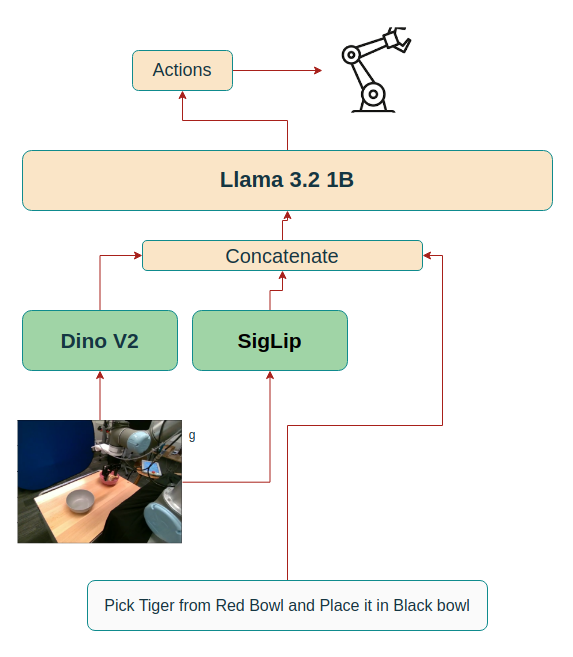

# Jetson-VLA: An Open-Source Vision Language Action Model for Edge Applications
<hr style="border: 2px solid gray;"></hr>

This Repository Implements [OpenVLA](https://openvla.github.io/) that could be deployed onto Low Powered Devices such as Jetson Nano using Low Compute Budget Models.

<hr style="border: 2px solid gray;"></hr>

# Model Architecture
Model comprises of DINO V2 Base (224px), SIGLIP Base(224px) as Image Encoders and Llama 3.2:1B as Language Model.

<p align="center">
  
</p>

<hr style="border: 2px solid gray;"></hr>

# Installation

```
git clone https://github.com/BhavikShangari/Jetson-VLA.git
cd Jetson-VLA
conda env create --name jetson_vla --file environment.yml
```

<hr style="border: 2px solid gray;"></hr>

# Dataset

For training the Model we used Bridge Data V2.

# Training

If starting from a Checkpoint


```
python3 train.py --model_path path/to/checkpoint.pt --per_device_batch_size 32 --learning_rate 2e-5 --output_dir ./results --epochs 10 --torch_compile True --save_strategy no --report_to wandb --lr_scheduler cosine --warmup_ratio 0.10 --logging_steps 100 --dataset_path data.csv --save_file_name path/to/model.pt
```
else

```
python3 train.py --per_device_batch_size 32 --learning_rate 2e-5 --output_dir ./results --epochs 10 --torch_compile True --save_strategy no --report_to wandb --lr_scheduler cosine --warmup_ratio 0.10 --logging_steps 100 --dataset_path data.csv --save_file_name path/to/model.pt
```
<hr style="border: 2px solid gray;"></hr>

# Checkpoints

Pre Trained Checkpoints are available:
<table>
<tr>
<th>Checkpoint Name</th>
<th>Gdown Checkpoint</th>
</tr>

<tr>
<td>Pretrained Llama 3.2:1B + DINOV2 BASE (224px) + SIGLIP BASE (224px)</td>
<td><center><a href="https://drive.google.com/file/d/1uLsQexKSHeEky7SZZ_6NvREqp8oLmUWl/view?usp=sharing">Link</a></center></td>
</tr>

</table>
<hr style="border: 2px solid gray;"></hr>

# Generation
For Generation Download the Checkpoints and place in the Checkpoints Folder

```
cd Checkpoints
gdown {Checkpoint}
cd ..
python3 generate.py --model_path Checkpoints/{MODEL}.pt --image_path Path/to/image.png --prompt 'Explain what this image depicts' --device cuda:0
```
<hr style="border: 2px solid gray;"></hr>

# Deployment on Jetson Nano
Coming Soon...